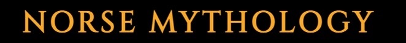
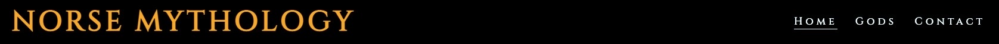
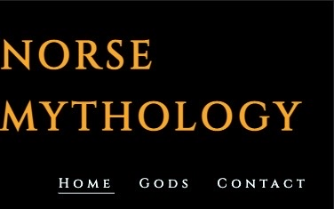
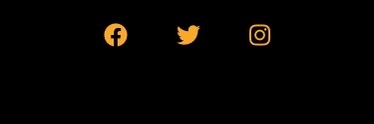
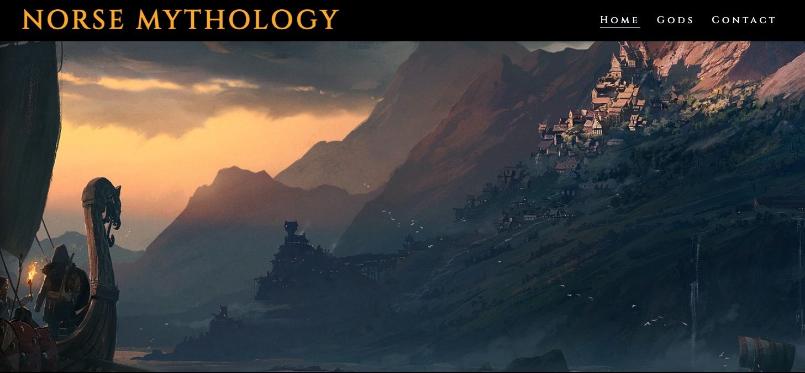
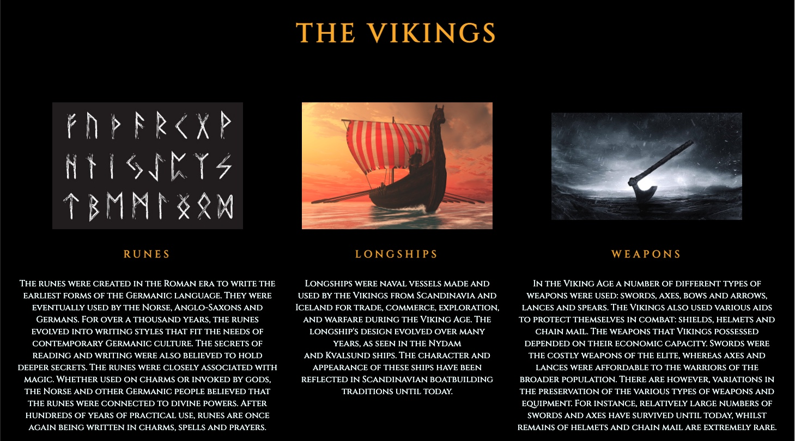
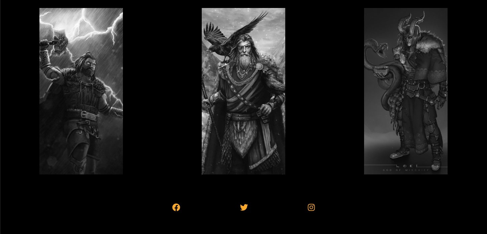

# Norse Mythology by Adam Weaver

This website was built for people who have an interest in all things Nordic.
It has some information on how the vikings are closley related to norse mythology and what they are known for. The website also provides an interative gallery page where you can interact with the images to reveal who they represent. With consideration on anymore inforamtion a viewing may need, it has a contact page for any quieries.

## [View Live Project here](https://github.com/AdamWeaver94/project-1/settings/pages#:~:text=https%3A//adamweaver94.github.io/project%2D1/)

## Website Mock up 

## Colour Palette

| Color             | Hex                                                                |
| ----------------- | ------------------------------------------------------------------ |
| Main headings colour (Custom) |  #F6B000 |
| Main text colour (Azure) |  #F0FFFF |
| Main backgrounud colour (Black)|  #000000 |

- #F6B000 headings colour was inspired because of the viking obsession with gold.
- F0FFFF text colour helps viewers of the page read clearly by being a contrasting colour to the background.
- #000000 background colour was chosen for the dramatic and intrguing experince a viewer may experinece when first opeing the website.

## Font

I chose Cinzel as the font because of its ancient history look of text, giving a older but fitting style for the page. Although it may be more Roman looking, I still founud it suits the page throughout.

## Features

The website contains 3 pages. The first page consits of some breif information on the vikings. There is a gallery section that has a overlay function over each of the images informing you what god it is. Finally a contact page where a user can feeback of the website and what they would like included or overall experience.

## Header

The header is reponsive throughout all screen sizes on devices. On a desktop the navigation tabs locate at the top right of the page. While on smaller devices, I wanted to keep the nav bar the same but had to adjust the size to fit underneather the header logo. I took the inspiration from the Code Institute Love Running project as best suited the layout I wanted.

## Footer

The footer is also reponsive throught all device screens. I wanted to kepp the icons in the centre on the screen and keep it simply and clear. This was also inspiration from the Love Running project but modified myself to work.

## Homepage

The homepage is where you can find out information on the vikings and interact with some images to make it more interative for users.

## Gallery

The gallery page is where a user can again interat with images, but find out what image they are looking at also, with the name of the god they are hoving over.

# Future Features

## Feedback from

The feedback form will need to be connected to a backend system to store data requests. This would be linked to a link back to the host to reply and take onboard user advice.

## Homepage

The homepage would have more information articles. More reactive areas which users can interact with.

## Gallery

The gallery would have more information on each overlay to give a detailed description of each image.

## Footer

The footer could connect to correct links relating to website social media sites once established.